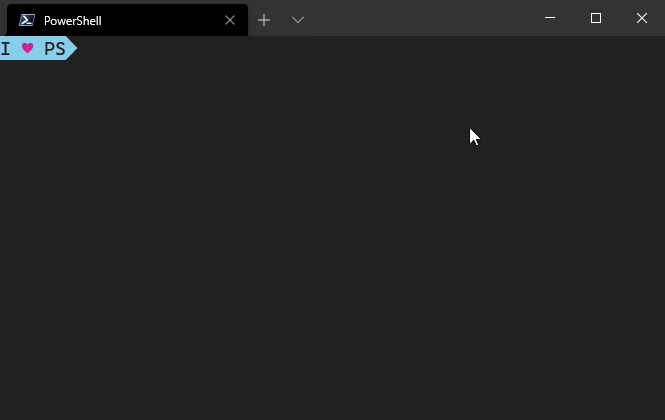

This is a simple "spinner" that writes a series of text strings to the same spot on the screen over and over ...

It has a bunch of pre-set spinner annimations from [cli-spinners](https://github.com/sindresorhus/cli-spinners) which you can [preview here](https://jsfiddle.net/sindresorhus/2eLtsbey/embedded/result/) or you can define your own by passing an array of frames.

There's not much to this, and for most cases, you should still use Write-Progress, so I don't think I'm going to take it any further than this.

